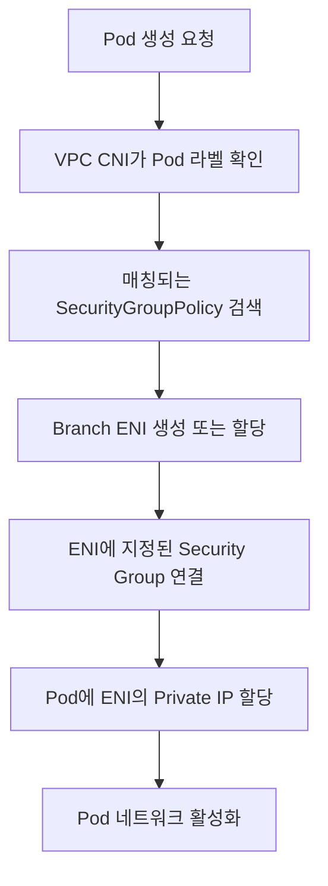

# 🔒 EKS Security Groups for Pods 기술 정리

## 📋 목차

1. [배경](#1-배경)
2. [Security Groups for Pods 개념](#2-security-groups-for-pods-개념)
3. [네트워크 동작 구조](#3-네트워크-동작-구조)
4. [핵심 구성 요소](#4-핵심-구성-요소)
5. [동작 흐름](#5-동작-흐름-pod-생성-시점)
6. [IAM 및 권한 요구사항](#6-iam-및-권한-요구사항)
7. [NetworkPolicy와의 기술적 차이](#7-networkpolicy와의-기술적-차이)
8. [Fargate와의 관계](#8-fargate와의-관계)
9. [성능 및 제한사항](#9-성능-및-제한사항)
10. [대표적인 사용 사례](#10-대표적인-사용-사례)
11. [요약](#11-요약)
12. [트래픽 흐름 변화 비교](#12-트래픽-흐름-변화-비교)

---

## 1. 배경

### 🔍 문제 상황

기본적인 Kubernetes 환경(EKS 포함)에서는 **Security Group(SG)**이 노드(EC2)에만 적용됩니다. Pod는 노드의 네트워크 네임스페이스 또는 CNI가 할당한 IP를 사용하지만, **네트워크 보안 통제는 노드 단위**로만 가능합니다.

### ❌ 기존 구조의 한계

- 🔴 서로 다른 성격의 Pod가 동일한 SG 규칙을 공유
- 🔴 특정 Pod만 RDS, ElastiCache 등 AWS 리소스 접근 제어 불가
- 🔴 멀티 테넌시, 보안 요구사항이 높은 환경에서 한계 발생

### ✅ 해결책

이를 해결하기 위해 AWS는 **Security Groups for Pods** 기능을 제공합니다.

---

## 2. Security Groups for Pods 개념

### 🎯 정의

**Security Groups for Pods**는 Pod 단위로 AWS Security Group을 직접 할당할 수 있는 기능입니다.

### 💡 핵심 아이디어

- 🎯 Pod마다 **전용 ENI(Elastic Network Interface)** 할당
- 🔐 해당 ENI에 **Pod 전용 Security Group 연결**
- 🌐 Pod가 VPC 네트워크 상에서 **독립적인 네트워크 엔드포인트**로 동작

> **핵심**: Pod가 AWS VPC 관점에서 EC2, RDS와 동일한 **네트워크 1급 시민(first-class citizen)**이 됩니다.

---

## 3. 네트워크 동작 구조

### 📊 기존 구조

```
┌─────────┐
│  Pod 1  │
└────┬────┘
     │
┌────┴────┐     ┌──────────────┐
│  Pod 2  │─────┤  Node ENI    │─── Security Group (Node SG)
└────┬────┘     └──────────────┘
     │
┌────┴────┐
│  Pod 3  │
└─────────┘
```

**특징**:
- 모든 Pod 트래픽은 Node ENI를 통해 송수신
- Node SG가 모든 Pod 트래픽을 통제

---

### ✨ Security Groups for Pods 적용 후

```
┌─────────┐     ┌─────────┐     ┌─────────┐
│ Pod A   │─────┤ ENI A   │─────┤  SG A   │
└─────────┘     └─────────┘     └─────────┘

┌─────────┐     ┌─────────┐     ┌─────────┐
│ Pod B   │─────┤ ENI B   │─────┤  SG B   │
└─────────┘     └─────────┘     └─────────┘
```

**특징**:
- ✅ Pod마다 별도의 ENI와 Private IP 할당
- ✅ Pod 단위로 Inbound / Outbound SG 규칙 적용
- ✅ SG 간 참조 가능 (예: Pod SG → RDS SG)

---

## 4. 핵심 구성 요소

### 4.1 AWS VPC CNI

**Amazon VPC Container Network Interface Plugin**

Amazon EKS는 VPC CNI라고도 하는 Amazon VPC 컨테이너 네트워크 인터페이스 플러그인을 통해 클러스터 네트워킹을 구현합니다.

**주요 특징**:
- CNI 플러그인을 사용하면 Kubernetes Pod가 VPC 네트워크에서와 동일한 IP 주소를 가질 수 있습니다
- Pod 내의 모든 컨테이너는 네트워크 네임스페이스를 공유하며 로컬 포트를 사용하여 서로 통신할 수 있습니다

**요구사항**:
- `amazon-vpc-cni-k8s` 플러그인 필요
- Pod에 Secondary IP 또는 Branch ENI 할당
- Security Group for Pods는 **Branch ENI 기반**으로 동작

---

### 4.2 Branch ENI

**Elastic Network Interface (Branch)**

- 🔌 EC2 인스턴스에 연결되는 보조 ENI
- 🎯 Pod 전용 네트워크 인터페이스 역할
- 🔐 각각 고유한 Security Group 연결 가능

---

### 4.3 SecurityGroupPolicy CRD

AWS에서 제공하는 Kubernetes CRD로, Pod Selector와 Security Group을 매핑합니다.

**예시**:

```yaml
apiVersion: vpcresources.k8s.aws/v1beta1
kind: SecurityGroupPolicy
metadata:
  name: pod-db-access
spec:
  podSelector:
    matchLabels:
      app: backend
  securityGroups:
    groupIds:
      - sg-0abc123456789
```

**설명**:
- `podSelector`: 대상 Pod 선택 (라벨 기반)
- `groupIds`: 적용할 Security Group ID 목록

---

## 5. 동작 흐름 (Pod 생성 시점)

### 🔄 Pod 생성 프로세스



**단계별 설명**:

1. 📝 **Pod 생성 요청**: Kubernetes API Server에 Pod 생성 요청
2. 🏷️ **라벨 확인**: VPC CNI가 Pod의 라벨 확인
3. 🔍 **Policy 검색**: 매칭되는 SecurityGroupPolicy 검색
4. 🔌 **ENI 생성**: Branch ENI 생성 또는 기존 ENI 할당
5. 🔐 **SG 연결**: ENI에 지정된 Security Group 연결
6. 🌐 **IP 할당**: Pod에 ENI의 Private IP 할당
7. ✅ **활성화**: Pod 네트워크 활성화 완료

---

## 6. IAM 및 권한 요구사항

### 🔑 필수 요구사항

Security Groups for Pods는 AWS 리소스를 직접 생성/제어하므로 **IRSA(IAM Role for Service Account)**가 필수입니다.

### 📋 필요 권한

다음 EC2 권한이 필요합니다:

| 권한 | 설명 |
|------|------|
| `ec2:CreateNetworkInterface` | Branch ENI 생성 |
| `ec2:AttachNetworkInterface` | ENI를 인스턴스에 연결 |
| `ec2:DeleteNetworkInterface` | ENI 삭제 |
| `ec2:DescribeNetworkInterfaces` | ENI 정보 조회 |
| `ec2:ModifyNetworkInterfaceAttribute` | ENI 속성 수정 (SG 변경) |

**예시 IAM Policy**:

```json
{
  "Version": "2012-10-17",
  "Statement": [
    {
      "Effect": "Allow",
      "Action": [
        "ec2:CreateNetworkInterface",
        "ec2:AttachNetworkInterface",
        "ec2:DeleteNetworkInterface",
        "ec2:DescribeNetworkInterfaces",
        "ec2:ModifyNetworkInterfaceAttribute"
      ],
      "Resource": "*"
    }
  ]
}
```

---

## 7. NetworkPolicy와의 기술적 차이

### 📊 비교표

| 항목 | Security Groups for Pods | Kubernetes NetworkPolicy |
|------|-------------------------|-------------------------|
| **제어 위치** | AWS VPC | CNI 내부 |
| **계층** | L3 / L4 | L3 / L4 |
| **AWS 리소스 제어** | ✅ 매우 강함 | ❌ 제한적 |
| **SG 참조** | ✅ 가능 | ❌ 불가 |
| **클라우드 종속성** | AWS 종속 | 이식성 높음 |
| **성능** | VPC 레벨 (고성능) | CNI 레벨 |

### 🎯 권장 전략

- **AWS 리소스 접근 제어**: 🔐 Security Groups for Pods
- **Pod ↔ Pod 통신 제어**: 🌐 NetworkPolicy

> **Tip**: 두 기술을 함께 사용하여 다층 방어 전략을 구현할 수 있습니다.

---

## 8. Fargate와의 관계

### 🚀 EKS Fargate

- ✅ EKS Fargate는 기본적으로 Pod 단위 ENI 사용
- ✅ 따라서 Security Group 개념이 자연스럽게 Pod 단위로 적용됨
- ⚠️ EC2 기반 EKS에서는 명시적으로 Security Groups for Pods 설정 필요

**비교**:

| 플랫폼 | Pod 단위 ENI | SG for Pods 설정 |
|--------|-------------|-----------------|
| **EKS Fargate** | ✅ 기본 제공 | 자동 적용 |
| **EKS (EC2)** | ❌ 기본 아님 | 명시적 설정 필요 |

---

## 9. 성능 및 제한사항

### ⚠️ ENI 제한

- 🔢 EC2 인스턴스 타입별 ENI 개수 제한 존재
- 📈 대량 Pod 환경에서 확장성 고려 필요

**예시** (일부 인스턴스 타입):
- `t3.medium`: 최대 3개 ENI
- `m5.large`: 최대 3개 ENI
- `c5.xlarge`: 최대 4개 ENI

### 🌐 IP 소모

- 📍 Pod마다 Private IP 사용
- 🎯 CIDR 크기 설계 중요

**고려사항**:
- 서브넷 CIDR 블록 크기 계획
- IP 주소 부족 시 서브넷 확장 필요

### 💰 비용

- ✅ ENI 자체 비용은 없음
- ⚠️ IP 부족 시 서브넷 확장 필요 가능

---

## 10. 대표적인 사용 사례

### 🎯 주요 사용 사례

1. **🔐 Backend Pod → RDS 접근 제어**
   - 특정 Pod만 RDS에 접근 허용
   - 세밀한 데이터베이스 보안 정책 적용

2. **🌍 특정 Pod만 외부 인터넷 접근 허용**
   - 인터넷 접근이 필요한 Pod만 선택적 허용
   - 보안 정책 강화

3. **🏢 멀티 테넌시 환경에서 Pod 단위 네트워크 격리**
   - 테넌트별 네트워크 격리
   - 리소스 접근 제어

4. **📋 보안 감사 요구사항 대응**
   - Pod 단위 트래픽 추적
   - 상세한 보안 로그 수집

---

## 11. 요약

### ✅ 핵심 포인트

- 🎯 Security Groups for Pods는 Pod를 AWS VPC 네트워크의 독립 엔드포인트로 만듭니다
- 🔓 Node 단위 SG의 한계를 극복하고 Pod 단위 보안 통제가 가능합니다
- 🏆 AWS 리소스 연계 보안이 중요한 경우 사실상 표준적인 선택입니다

### 💬 한 줄 요약

> **Security Groups for Pods = Kubernetes Pod에 AWS Security Group을 직접 적용하는 VPC 네이티브 보안 기능**

---

## 12. 트래픽 흐름 변화 비교

### 📊 [1] 전체 개념 비교

| 구분 | 기존 (Node SG) | Security Groups for Pods |
|------|---------------|-------------------------|
| **네트워크 종착지** | Node ENI | Pod ENI |
| **SG 평가 위치** | Node ENI | Pod ENI |
| **보안 제어 단위** | Node | Pod |
| **Pod 전용 SG** | ❌ 불가능 | ✅ 가능 |
| **Node 경유 (DataPath)** | 항상 경유 | 우회 가능 |
| **VPC 관점 엔드포인트** | Node | Pod |

**핵심 요약**:
- Kubernetes 구조는 동일
- VPC 레벨에서 트래픽 종착지가 **Node → Pod**로 이동

---

### 📥 [2] 외부 → Pod (Ingress) 트래픽 흐름

| 항목 | 기존 방식 | SG for Pods |
|------|----------|-------------|
| **ALB Target** | Node IP | Pod IP |
| **중간 경로** | ALB → Node → kube-proxy → Pod | ALB → Pod |
| **SG 검사 지점** | Node SG | Pod SG |
| **헬스체크 대상** | NodePort | Pod Port |
| **네트워크 홉 수** | 많음 | 적음 |

**트래픽 흐름 비교**:

```
기존: Client → ALB → Node → Pod
변경: Client → ALB → Pod
```

**장점**:
- ✅ 네트워크 홉 감소로 지연 시간 단축
- ✅ 직접적인 Pod 레벨 보안 제어

---

### 📤 [3] Pod → 외부 (Egress) 트래픽 흐름

| 항목 | 기존 | SG for Pods |
|------|-----|-------------|
| **Source IP** | Node IP (SNAT 발생) | Pod IP 유지 |
| **Egress SG 제어** | Node 단위 | Pod 단위 |
| **외부 로그 기준** | Node 기준 | Pod 기준 |
| **RDS 접근 제어** | 간접/불명확 | 정확 |

**핵심 변화**:
- ✅ Pod가 직접 외부와 통신
- ✅ 보안 감사 및 트래픽 추적 용이
- ✅ SNAT 제거로 Source IP 추적 가능

---

### 🔄 [4] Pod ↔ Pod 통신

| 통신 유형 | 실제 경로 | SG 영향 |
|----------|---------|---------|
| **같은 노드** | veth ↔ veth | 없음 |
| **다른 노드** | Pod ENI → VPC → Pod ENI | 있음 |
| **SG 평가** | 기존: 없음 | Ingress + Egress |

**참고**:
- NetworkPolicy와 병행 가능
- 같은 노드 내 통신은 여전히 효율적

---

### 🏗️ [5] Kubernetes 레이어 관점 변화 여부

| 레이어 | 변화 여부 | 설명 |
|--------|----------|------|
| **Ingress Controller** | ❌ 없음 | 동일 |
| **Service** | ❌ 없음 | ClusterIP / NodePort 동일 |
| **kube-proxy** | ⚠️ 논리 유지 | 데이터 패스 감소 가능 |
| **L7 라우팅** | ❌ 없음 | HTTP/gRPC 동일 |
| **L3/L4 데이터 플레인** | ✅ 변경됨 | VPC 레벨 경로 변경 |

**설명**:
- 상위 레이어 (Service, Ingress)는 변경 없음
- 하위 레이어 (VPC 데이터 플레인)만 변경

---

### 📝 [6] 한 문장 요약 모음

1. ✅ Service 흐름은 바뀌지 않는다.
2. 🎯 트래픽 종착지는 Node에서 Pod로 이동한다.
3. 🔐 Security Group 평가 지점이 Pod ENI로 이동한다.
4. 🚪 Node는 더 이상 데이터 트래픽의 관문이 아니다.
5. 🌐 Pod가 VPC 네트워크의 직접 엔드포인트가 된다.

---

### 🎯 [최종 한 줄 요약]

> **Security Groups for Pods를 사용하면 Kubernetes 구조는 그대로 유지되지만, VPC 관점에서 트래픽 경로와 보안 통제의 중심이 Node에서 Pod로 이동한다.**

---

## 📚 참고 자료

- [AWS 공식 문서 - Security Groups for Pods](https://docs.aws.amazon.com/eks/latest/userguide/security-groups-for-pods.html)
- [AWS VPC CNI Plugin](https://github.com/aws/amazon-vpc-cni-k8s)
- [Kubernetes Network Policies](https://kubernetes.io/docs/concepts/services-networking/network-policies/)

---
